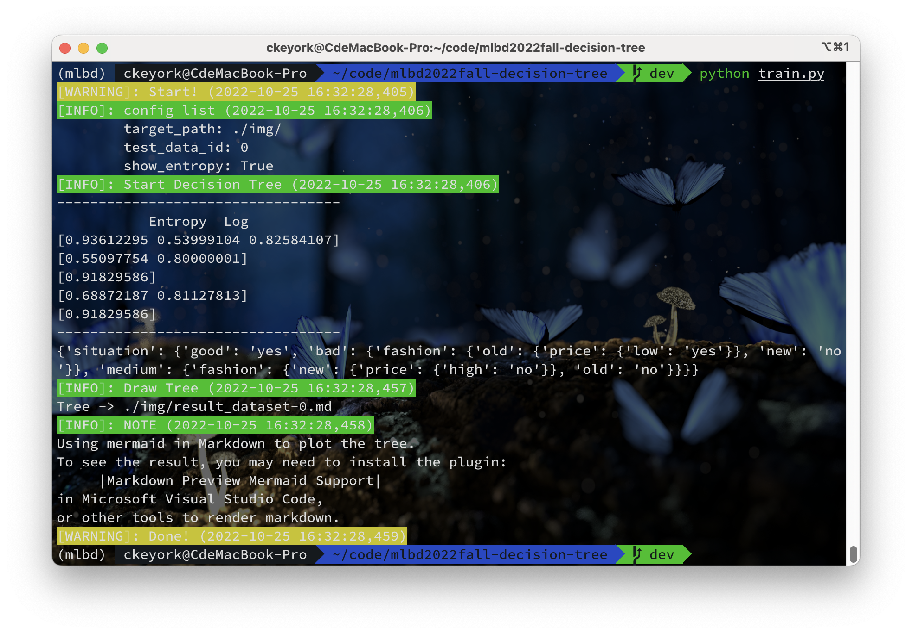
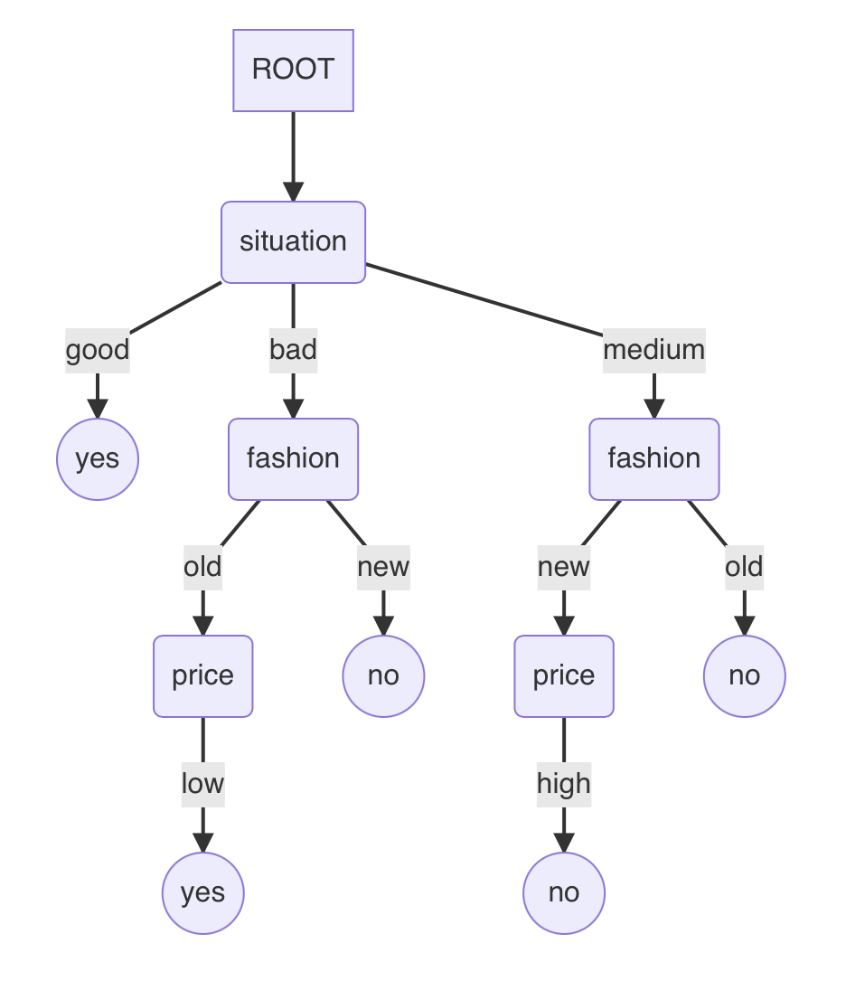

# mlbd2022fall-decision-tree

Machine Learning & Big Data 2022 Fall homework 3: decision tree

https://github.com/keyork/mlbd2022fall-decision-tree

## 🎉 Main Contributions

- A general discrete value decision tree solver

  - data -> tree(dict)

- A plotter from dict to decision tree images
  - tree(dict) -> image

## Task

See [task.md](https://github.com/keyork/mlbd2022fall-decision-tree/blob/main/task.md).

## Usage

```shell
pip install numpy pandas colorlog
python train.py -h
python train.py --args ARGS ...
```

## Model

### Decision Tree

Using average entropy as the basis for selecting nodes.

$$
average\ Entropy = \min\limits_{j, t_j} \{ \sum_{k}\frac{N_k}{N}Entropy(k|j, t_j) \}
$$

Calculations are performed recursively, if the labels in data are the same or data can't be split anymore, stop recursive algorithm.

```pseudocode
procedure DECISIONTREE(dataset, times)
	times <- times + 1
	if label in dataset are the same:
		return label
    end if
    if times == classes_num:
    	return most_times_label
    end if
    node <- min entropy's node
    tree = {node:{}}
    for sub_label in rest_label:
    	tree[node][sub_label] <- DECISIONTREE(dataset[sub_label], times)
    end for
end procedure
```

Save the tree in a dict, e.g. :

```
{'situation': {'good': 'yes', 'bad': {'fashion': {'old': {'price': {'low': 'yes'}}, 'new': 'no'}}, 'medium': {'fashion': {'new': {'price': {'high': 'no'}}, 'old': 'no'}}}}
```

## Plot Tree

dict -> mermaid in markdown -> img

Divide the content in the dict into three categories: label(e.g., situation, fashion, price), classification(e.g., good, bad), and judgment result(e.g., yes, no). Walk the dict:

- when label -> Save the label and its ID like `A1(situation)`
- when classification
  - children is dict -> Connect this node, the root node of this node(must be label), and the children of this node(must be label), like `A1 -->|good|A2`
  - children is value(judgment result) -> Connect this node, the root node of this node(must be label), and the children of this node(must be judgment result), like `A1 -->|bad|C1`, then save the judgment result like `C1(yes)`

Save as markdown file and render it.

**Usage**

```python
from utils.drawtoolbox import draw_tree
draw_tree(tree: dict, label_list: list, target_path: str)
```

## Result


