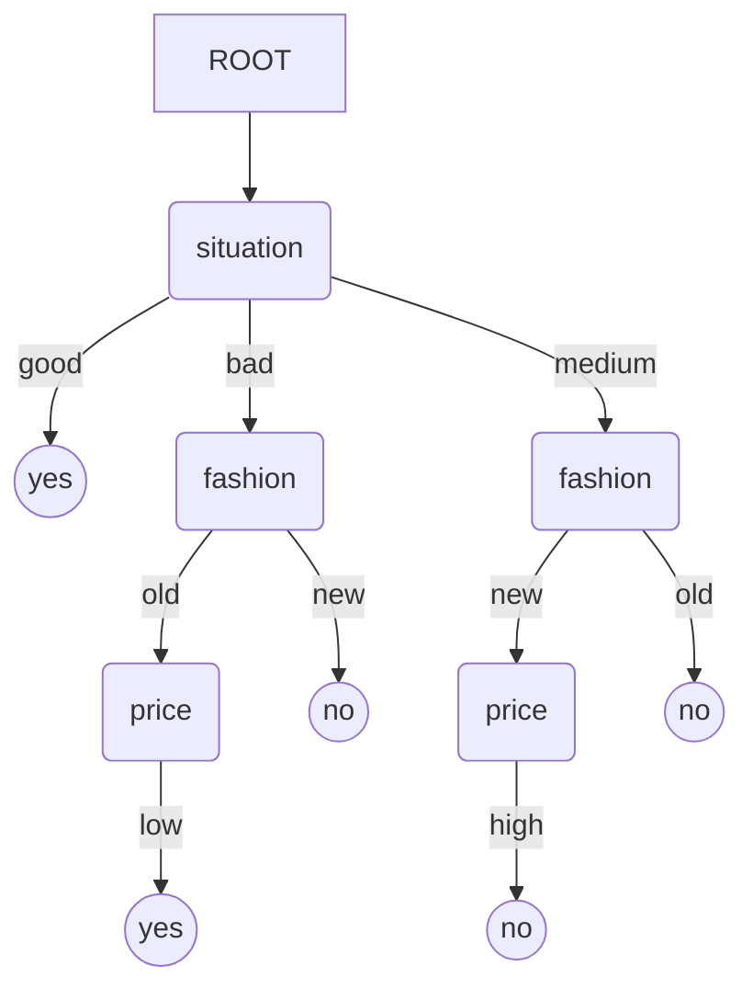

```mermaid
graph TB
A0[ROOT] -->A1
A1(situation)
C1((yes))
A1 -->|good|C1
A1 -->|bad|A2
A2(fashion)
A2 -->|old|A3
A3(price)
C2((yes))
A3 -->|low|C2
C3((no))
A2 -->|new|C3
A1 -->|medium|A4
A4(fashion)
A4 -->|new|A5
A5(price)
C4((no))
A5 -->|high|C4
C5((no))
A4 -->|old|C5
```
