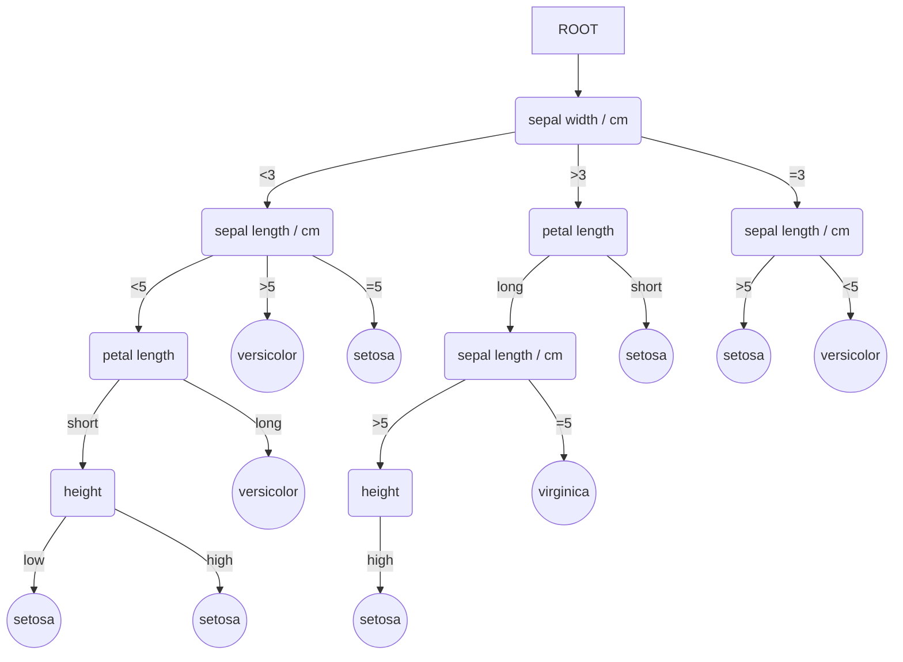

```mermaid
graph TB
A0[ROOT] -->A1
A1(sepal width / cm)
A1 -->|<3|A2
A2(sepal length / cm)
A2 -->|<5|A3
A3(petal length)
A3 -->|short|A4
A4(height)
C1((setosa))
A4 -->|low|C1
C2((setosa))
A4 -->|high|C2
C3((versicolor))
A3 -->|long|C3
C4((versicolor))
A2 -->|>5|C4
C5((setosa))
A2 -->|=5|C5
A1 -->|>3|A5
A5(petal length)
A5 -->|long|A6
A6(sepal length / cm)
A6 -->|>5|A7
A7(height)
C6((setosa))
A7 -->|high|C6
C7((virginica))
A6 -->|=5|C7
C8((setosa))
A5 -->|short|C8
A1 -->|=3|A8
A8(sepal length / cm)
C9((setosa))
A8 -->|>5|C9
C10((versicolor))
A8 -->|<5|C10
```
